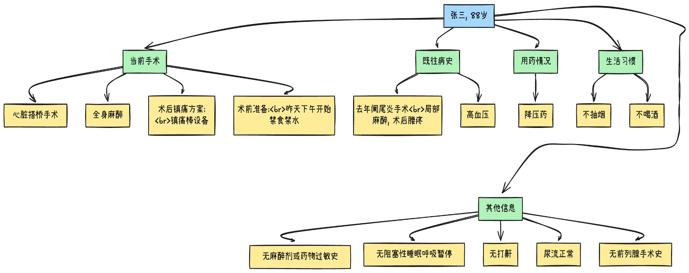

# 医学Graph RAG助手系统

一个基于LangChain和LangGraph的智能医疗对话系统，专注于麻醉术前评估和患者沟通。

## 功能特点

- 🏥 **多Agent协作**：主治医生和专科医生无缝协作
- 📋 **信息采集**：智能提取和验证患者信息
- 📝 **病史记录**：系统化采集患者病史
- ⚠️ **风险评估**：全面的麻醉风险评估
- 🤝 **患者沟通**：通俗易懂的风险解释
- 🎤 **语音交互**：支持语音输入和输出

## 系统架构


## 交互流程


## 状态信息



## 环境要求

- Python 3.11
- OpenAI API密钥
- Tavily API密钥（用于搜索功能）
- LangSmith账号（可选，用于追踪和调试）

## 安装步骤

1. 克隆项目
```bash
git clone https://github.com/fanfer/LLM-KG-Anesthesia.git
cd LLM-KG-Anesthesia
```

2. 创建虚拟环境
```bash
python -m venv venv
source venv/bin/activate  # Linux/Mac
# 或
.\venv\Scripts\activate  # Windows
```

3. 安装依赖
```bash
pip install -r requirements.txt
```

4. 配置环境变量
```bash
# 复制环境变量模板
cp .env.example .env

# 编辑.env文件，填入以下配置：
OPENAI_API_BASE=https://api.openai.com/v1  # OpenAI API地址
OPENAI_API_KEY=your-api-key                # OpenAI API密钥
TAVILY_API_KEY=your-tavily-key            # Tavily API密钥

# 可选的LangSmith配置
LANGCHAIN_TRACING_V2=true                 # 启用追踪
LANGCHAIN_ENDPOINT=https://api.smith.langchain.com  # LangSmith API地址
LANGCHAIN_API_KEY=your-langsmith-key      # LangSmith API密钥
LANGCHAIN_PROJECT=your-project-name       # 项目名称
```

## 运行项目

1. 启动命令行版本
```bash
python main.py
```

2. 启动网页版本
```bash
python web/app.py
```
然后在浏览器中访问 http://localhost:8080

默认用户名：admin
默认密码：imds1234

## 交互示例
```
AI: 您好,我是您的麻醉医生。请问您怎么称呼?

用户: 我叫张三
AI: 张三先生您好，请问您要进行什么手术呢？

用户: 我要做心脏搭桥手术
AI: 好的，我需要了解一下您的具体情况...
```

## 开发指南

### 运行测试
```bash
# 安装测试依赖
pip install pytest

# 运行测试
pytest tests/
```

### 查看系统架构
```bash
# 生成系统架构图
python main.py --draw-graph
```

## 注意事项

1. API密钥安全
   - 不要将.env文件提交到版本控制
   - 保护好您的API密钥
   - 定期更新API密钥

2. 使用限制
   - 注意API调用频率限制
   - 合理使用搜索功能
   - 遵守API使用条款

3. 开发建议
   - 遵循代码规范
   - 添加适当的注释
   - 编写单元测试
   - 保持代码整洁

## 许可证

MIT License

## 联系方式

如有问题或建议，请提交Issue或Pull Request。

## 网络访问配置

1. 本地访问
```bash
python web/app.py
```
然后在浏览器访问 http://localhost:5000

2. 局域网访问
- 查看本机IP地址：
  ```bash
  # Windows
  ipconfig
  
  # Linux/Mac
  ifconfig 或 ip addr
  ```
- 启动应用后，其他设备可通过 http://你的IP地址:5000 访问

3. 公网访问
- 配置防火墙开放5000端口
- 配置路由器端口转发（将外部端口映射到内部5000端口）
- 使用公网IP或域名访问

4. 安全建议
- 在生产环境中使用HTTPS
- 使用反向代理（如Nginx）
- 配置适当的访问控制
- 更改默认端口
- 设置强密码
